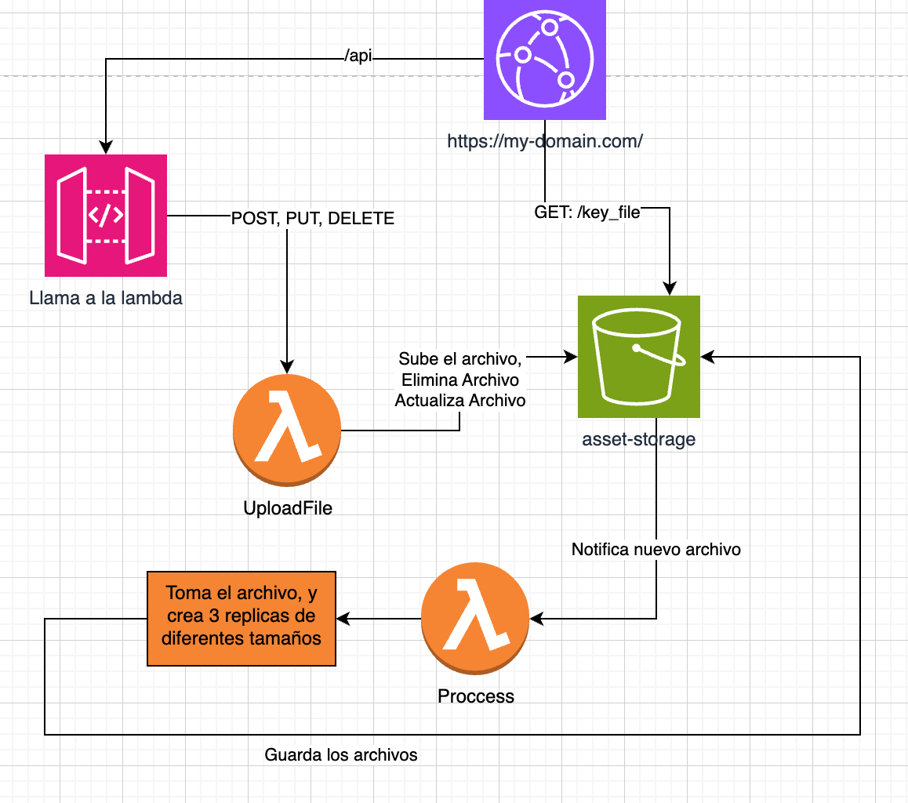

# Image Lambda API

Procesador de imágenes serverless que recibe imágenes a través de API Gateway, las procesa con Lambda y las almacena en S3 con diferentes tamaños, servidas a través de CloudFront.

## 📋 Descripción del Proyecto

Este proyecto implementa una API serverless completa para el procesamiento y almacenamiento de imágenes en AWS. La arquitectura está diseñada para ser escalable, eficiente y fácil de desplegar.

### ¿Qué hace este proyecto?

- **API REST**: Endpoints para subir, actualizar y eliminar imágenes
- **Procesamiento Automático**: Convierte automáticamente las imágenes en múltiples tamaños
- **CDN Global**: Sirve las imágenes a través de CloudFront para mejor rendimiento
- **Infraestructura como Código**: Todo definido con AWS CDK para fácil despliegue

### ¿Cómo está integrado?

El proyecto utiliza una arquitectura de microservicios serverless donde cada componente tiene una responsabilidad específica:

- **API Gateway**: Maneja las peticiones HTTP y autenticación
- **Lambda Functions**: Procesan la lógica de negocio (upload y process)
- **S3**: Almacena las imágenes originales y procesadas
- **CloudFront**: Distribuye el contenido globalmente
- **CloudWatch**: Monitorea y registra logs

## 🏗️ Arquitectura



### Flujo de Procesamiento:

1. **API Gateway** recibe la imagen a través del endpoint `/api/`
2. **Lambda (upload)** procesa la imagen inicial y la guarda en S3
3. **S3** dispara automáticamente otra **Lambda (process)** cuando detecta un nuevo archivo
4. **Lambda (process)** comprime la imagen en tres versiones: original, medium y small
5. **CloudFront** sirve las imágenes procesadas desde S3 con dominio personalizado

## 🚀 Tecnologías

- **TypeScript** - Tipado estático
- **AWS SDK v3** - SDK moderno de AWS
- **Sharp** - Procesamiento de imágenes
- **Sentry** - Monitoreo de errores (opcional)
- **CDK** - Infraestructura como código
- **CloudFront** - CDN y routing inteligente
- **CloudWatch** - Logs y monitoreo

## 🚀 Despliegue

### Prerrequisitos

- Node.js 18+ instalado
- AWS CLI configurado con credenciales
- Dominio personalizado configurado en Route 53 (opcional)

### Variables de Configuración

Antes de desplegar, debes configurar las siguientes variables en tu archivo `.env`:

```bash
# AWS Configuration
AWS_S3_REGION=us-east-1

# S3 Bucket Configuration
S3_BUCKET_IMAGES=your-image-bucket-name

# Environment
ENVIRONMENT=production

# Sentry Configuration (opcional)
SENTRY_DSN=your_sentry_dsn_here
SENTRY_ENVIRONMENT=production

# Image Processing Configuration
ACCEPTED_TYPES=jpeg|png
MEDIUM_RESOLUTION=800x600
SMALL_RESOLUTION=400x300
IMAGE_FIT=cover

# API Configuration
URL=https://your-domain.com
```

### Pasos de Despliegue

1. **Clonar y configurar el proyecto:**

```bash
git clone <your-repo-url>
cd api-image-processor
npm install
```

2. **Configurar variables de entorno:**

```bash
cp env.example .env
# Editar .env con tus valores
```

3. **Verificar configuración:**

```bash
npm run config:check
```

4. **Compilar el proyecto:**

```bash
npm run build
```

5. **Desplegar la infraestructura:**

```bash
cd infra
npm install
npm run build
cdk deploy
```

### Dominio Personalizado

Para usar tu propio dominio:

1. Configura tu dominio en Route 53
2. Actualiza la variable `URL` en tu `.env`
3. El CDK creará automáticamente el certificado SSL con ACM
4. Configurará CloudFront para usar tu dominio

## 🔄 GitHub Actions para CI/CD

El proyecto incluye workflows de GitHub Actions preconfigurados para automatizar el despliegue:

### Workflows Disponibles

- **`deploy.yml`**: Despliega automáticamente en cada push a main
- **`test.yml`**: Ejecuta tests antes del despliegue
- **`security.yml`**: Escaneo de seguridad del código

### Configuración de Secrets

Para usar los GitHub Actions, configura estos secrets en tu repositorio:

- `AWS_ACCESS_KEY_ID`: Tu AWS Access Key
- `AWS_SECRET_ACCESS_KEY`: Tu AWS Secret Key
- `AWS_REGION`: Región de AWS (ej: us-east-1)

### Activación

Los workflows se activan automáticamente cuando:

- Se hace push a la rama `main` → Despliegue automático
- Se crea un Pull Request → Ejecución de tests
- Se hace push a cualquier rama → Escaneo de seguridad

## 📦 Instalación Local

```bash
# Instalar dependencias
npm install

# Verificar configuración
npm run config:check

# Compilar TypeScript
npm run build

# Ejecutar en desarrollo
npm run dev

# Ejecutar en producción
npm start
```

## 🔧 Scripts Disponibles

- `npm run build` - Compilar TypeScript a JavaScript
- `npm run dev` - Ejecutar en modo desarrollo con ts-node
- `npm run start` - Ejecutar versión compilada
- `npm run config:check` - Verificar configuración
- `npm run watch` - Compilar en modo watch
- `npm run clean` - Limpiar archivos compilados
- `npm run build:lambda` - Construir para despliegue Lambda

## 🚀 API Endpoints

### Base URL

```
https://your-domain.com/api
```

### 1. Subir Imagen (POST)

**Endpoint:** `POST /api/`

**Body:**

```json
{
  "file_name": "mi_imagen",
  "base64": "data:image/jpeg;base64,/9j/4AAQSkZJRgABAQAAAQ..."
}
```

**Respuesta Exitosa:**

```json
{
  "statusCode": 200,
  "statusMessage": "OK",
  "resourcesName": {
    "small": "https://your-domain.com/processed/mi_imagen_small.jpeg",
    "medium": "https://your-domain.com/processed/mi_imagen_medium.jpeg",
    "original": "https://your-domain.com/processed/mi_imagen_original.jpeg"
  }
}
```

### 2. Actualizar Imagen (PUT)

**Endpoint:** `PUT /api/`

**Body:**

```json
{
  "file_name": "nueva_imagen",
  "current_file_name": "imagen_anterior",
  "base64": "data:image/jpeg;base64,/9j/4AAQSkZJRgABAQAAAQ..."
}
```

**Respuesta Exitosa:**

```json
{
  "statusCode": 200,
  "statusMessage": "OK",
  "resourcesName": {
    "small": "https://your-domain.com/processed/nueva_imagen_small.jpeg",
    "medium": "https://your-domain.com/processed/nueva_imagen_medium.jpeg",
    "original": "https://your-domain.com/processed/nueva_imagen_original.jpeg"
  }
}
```

### 3. Eliminar Imagen (DELETE)

**Endpoint:** `DELETE /api/`

**Body:**

```json
{
  "file_name": "mi_imagen_small.jpeg"
}
```

**Respuesta Exitosa:**

```json
{
  "statusCode": 200,
  "statusMessage": "OK"
}
```

## 🖼️ Acceso a Imágenes

Una vez procesadas, las imágenes están disponibles directamente a través de CloudFront:

### URLs de Acceso:

```
https://your-domain.com/processed/{nombre_imagen}_original.jpeg
https://your-domain.com/processed/{nombre_imagen}_medium.jpeg
https://your-domain.com/processed/{nombre_imagen}_small.jpeg
```

### Ejemplo:

```bash
# Imagen original
https://your-domain.com/processed/hello_world3_original.jpeg

# Imagen mediana
https://your-domain.com/processed/hello_world3_medium.jpeg

# Imagen pequeña
https://your-domain.com/processed/hello_world3_small.jpeg
```

## 🔄 Procesamiento Automático

### Flujo Detallado:

1. **Subida Inicial**: La imagen se guarda en `S3://bucket/toProcess/`
2. **Trigger Automático**: S3 dispara la Lambda `process` automáticamente
3. **Procesamiento**: Sharp crea tres versiones con diferentes resoluciones:
   - **Original**: Resolución original
   - **Medium**: 800x600 (configurable)
   - **Small**: 400x300 (configurable)
4. **Almacenamiento**: Las imágenes procesadas se guardan en `S3://bucket/processed/`
5. **Disponibilidad**: Inmediatamente disponibles a través de CloudFront

## 📁 Estructura del Proyecto

```
src/
├── services/
│   ├── aws.ts          # Servicios de AWS S3
│   ├── helper.ts       # Utilidades
│   ├── imageHandler.ts # Manejo de imágenes
│   └── processImages.ts # Procesamiento de imágenes
├── settings/
│   └── config.ts       # Configuración
├── types/
│   ├── index.ts        # Tipos TypeScript
│   └── lambda.ts       # Tipos para eventos Lambda
└── utils/
    └── config-checker.ts # Verificador de configuración

# Entrypoints de Lambda
upload.ts               # Lambda para subir imágenes (API Gateway)
process.ts              # Lambda para procesar imágenes (S3 Trigger)

# Infraestructura CDK
infra/                  # Stack de infraestructura
```

## 🚀 Entrypoints de Lambda

### **upload.ts** - Lambda para API Gateway

- **Trigger**: API Gateway
- **Funcionalidad**: Maneja operaciones CRUD de imágenes
- **Métodos**: POST (upload), PUT (update), DELETE (delete)
- **Entrada**: Eventos de API Gateway
- **Salida**: Respuestas HTTP con CORS

### **process.ts** - Lambda para procesamiento

- **Trigger**: S3 Event (cuando se sube una imagen)
- **Funcionalidad**: Procesa imágenes y crea diferentes tamaños
- **Entrada**: Eventos de S3
- **Salida**: Imágenes procesadas en S3

## 🔄 Migración de AWS SDK v2 a v3

El proyecto ha sido migrado completamente a AWS SDK v3, que ofrece:

- **Mejor rendimiento** - Bundle más pequeño
- **Tipado nativo** - Mejor soporte TypeScript
- **Modular** - Solo importar lo que necesitas
- **Promesas nativas** - Sin necesidad de `.promise()`

### Cambios principales:

```typescript
// Antes (AWS SDK v2)
const s3 = new AWS.S3();
const result = await s3.getObject(params).promise();

// Ahora (AWS SDK v3)
import { S3Client, GetObjectCommand } from "@aws-sdk/client-s3";
const client = new S3Client({ region: "us-east-1" });
const command = new GetObjectCommand(params);
const result = await client.send(command);
```

## 📊 Monitoreo y Logs

### CloudWatch Logs

- **Logs de CloudFront**: Automáticamente enviados a CloudWatch
- **Logs de Lambda**: Monitoreo de funciones upload y process
- **Retención**: 7 días en desarrollo, 30 días en producción

### Métricas Disponibles

- **Requests por minuto**
- **Tiempo de respuesta**
- **Errores 4xx/5xx**
- **Cache hit/miss ratio**

## 🔧 Configuración de Infraestructura

### CloudFront Routing:

- **`/api/*`** → API Gateway (CRUD de imágenes)
- **`/*`** → S3 Bucket (servir imágenes)

### Dominio Personalizado:

- **URL**: Configurable en variables de entorno
- **SSL**: Certificado automático con ACM
- **CORS**: Configurado automáticamente

## 📝 Licencia

ISC
